## 8.0 Security Engineering Evaluation

### 8.1 Threat Model & Network Security Evaluation

- **Assets**  
  - Live RTSP video feeds (customer imagery)  
  - Demographic analytics / PII derived from video  
  - User credentials & RBAC metadata  
  - Configuration secrets (camera passwords, Wi-Fi keys)  
- **Primary Threat Actors**  
  - External attacker on same LAN / Internet  
  - Malicious insider with dashboard access  
  - Physical attacker with access to Raspberry Pi  
- **Attack Surface**  
  - RTSP cameras ⟶ Raspberry Pi configured as Wi-Fi AP / hotspot that **segregates cameras onto a private WLAN & forwards RTSP** over wired uplink via iptables NAT/ACLs  
  - Flask REST API exposed on port 443  
  - Local SQLite database store  
  - Backend Windows workstation running Flask, analytical models & SQLite store  
  - **Raspberry Pi is stateless**; no persistent storage beyond OS, acts purely as RTSP ➜ TLS proxy  
  - SSH management channel on Pi  
- **Key Network-Level Risks**  
  - **RTSP is plaintext** ➜ credentials + video can be sniffed / replayed  
  - Default camera passwords reused  
  - MITM of HTTP traffic if TLS disabled  
  - Brute-force login → account lockout required (implemented @ 5 attempts, 30 s lock)  
- **Mitigations in Place**  
  - RTSP traffic limited to camera VLAN; Pi never exposes raw RTSP externally  
  - Pi applies `iptables` stateful firewall (default‐deny) & NAT; only RTSP (554) and ICMP from cameras allowed outbound.  
  - Camera WLAN uses **WPA2-PSK (AES-CCMP)**; key rotated quarterly; mitigates over-the-air interception.  
  - Pi only layer-3 forwards (DNAT) RTSP traffic; does **not** inspect or re-encode streams  
  - Argon2id password hashing, 32-byte salt, 64 MiB memory  
  - Strict `SameSite=Strict`, `HttpOnly`, `Secure` cookies  
  - Automatic session expiry (2 h) & cleanup task  
  - Firewall rules (iptables + ufw): inbound **443/tcp**, **22/tcp** (from Mgmt-LAN only); default-deny all else.  
  - `fail2ban` monitors SSH & Flask auth, bans IP for 10 min after 10 failed requests.  
  - `auditd` enabled: tracks file-access to DB & config YAML.  
  - Pi boots **read-only root**; `/var/lib` overlay-fs; iptables rules persist in `/etc/iptables/rules.v4`.  
  - Pi SD card contains only boot image; no application data. Theft risk limited to network credentials (mitigated via unique PSK & VLAN).  
  - Windows backend uses **BitLocker XTS-AES-256** full-disk encryption & TPM-bound key.  
  - VLAN ACL denies East-West traffic between cameras (prevent lateral movement).  
  - Cloud-flare Tunnel optional: terminates TLS ∴ hides origin IP from Internet.  
  - WLAN frames protected with WPA2; rogue AP detections logged via `hostapd_cli`.  

### 8.2 Cryptographic Control Justification

- **Password Storage** – Argon2id chosen for GPU-resistance and memory hardness; parameters align with OWASP 2025 recommendations.  
- **Transport Security** – Strict TLS 1.3; `ECDHE+AES-GCM` only, HSTS (2y), CSP, Referrer-Policy enforced in Flask.  
- **Session Tokens** – 256-bit `secrets.token_urlsafe` values, stored server-side & rotated on login.  
- **Video Encryption** – Plan to upgrade cameras to SRTP or tunnel RTSP through TLS; interim control is segregated VLAN & re-encrypted WebSocket stream.  
- **Data-at-Rest** – SQLite DB stored on Windows host encrypted with BitLocker; regular volume shadow copies for backup.  
- **API Tokens** – Service-to-service calls signed with Ed25519 JWT (exp=5 min).  
- **Firmware Updates** – Pi OS images verified via GPG signature chain.  
- **Wireless Encryption** – Camera Wi-Fi SSID secured with WPA2-PSK; 64-bit random passphrase; management frames protected via 802.11w.  

### 8.3 Privacy-by-Design Evaluation

- **Data Minimisation** – Store only derived demographics + low-res face snapshots; raw frames discarded after real-time inference.  
- **Purpose Limitation** – Video used solely for in-store analytics → documented in privacy notice.  
- **User Control** – Admin UI allows purge of all demographic data & face images.  
- **Access Control** – RBAC tiers (admin/manager/viewer) enforce least privilege.  
- **Storage Limitation** – 30-day retention for face snapshots **and** raw detection boxes; Configurable via YAML.  
- **Centralised Processing** – All face detection & analytics run on Windows backend; Pi forwards raw streams only, ensuring compute & data remain in secured zone.  
- **Data Sovereignty** – All processing on-prem; no personal data sent to 3rd-party cloud.  
- **DSAR Readiness** – Per-user query endpoints allow export / erasure to comply with GDPR Art. 20 & 17.  
- **Transparency & Audit** – All logins / data exports logged with timestamp & IP.  

### 8.4 Data-Flow Overview (Revised)

> Diagram emphasises WPA2 at the edge, iptables DNAT/firewall, and internal segmentation on the Windows host where all processing & storage occur.

### 8.5 Authentication & Password-Management Flow

```mermaid
sequenceDiagram
    autonumber
    participant Client
    participant AuthAPI
    participant DB

    Client->>AuthAPI: POST /api/auth/login (user, pass)
    AuthAPI->>DB: fetch user record
    DB-->>AuthAPI: Argon2id hash, failedAttempts, lockUntil
    alt Account locked (<30 s remaining)
        AuthAPI-->>Client: 401  "Account locked – retry later"
    else Password mismatch
        AuthAPI->>DB: failedAttempts++
        AuthAPI-->>Client: 401  "Invalid credentials"
    else Password match
        AuthAPI->>DB: reset failedAttempts & issue sessionToken
        AuthAPI-->>Client: 200  {sessionToken, isDefaultPwd}
        Note over Client: Store HttpOnly cookie
        opt Default password flag == true
            Note over Client: Display yellow prompt → change password
        end
    end
```

### 8.5 Secure Development Lifecycle (SDL)

- **Requirements** – STRIDE threat modelling done for each major feature.  
- **Code Quality** – `ruff`, `mypy`, `bandit` run in pre-commit; CI fails on High findings.  
- **Dependencies** – `pip-compile` locks versions; *renovate-bot* auto-PRs patches; `safety` scan nightly.  
- **Secrets Mgmt** – `.env` encrypted in *age* format; CI injects secrets at runtime via GH OIDC.  
- **Pen-testing** – Internal red-team review each quarter; last report: no critical vulns.  
- **Incident Response** – Syslog shipped to Graylog; Slack webhook alerts on auth anomalies.  

### 8.6 Residual Risk Assessment

| Risk | Likelihood | Impact | Residual Rating | Notes |
|------|------------|--------|-----------------|-------|
| Pi physical theft | Low | Medium | **Low** | Proxy only; no data stored. WPA2-PSK rotation mitigates Wi-Fi creds leakage.
| RTSP credential reuse | Medium | Medium | **Medium** | VLAN + future SRTP migration.
| Insider data export via dashboard | Low | High | **Low** | RBAC, audit logs, export size throttling.
| Compromise of Windows backend | Low | High | **Medium** | Hardened host firewall, BitLocker, LSASS PPL, weekly patch cycle.

### 8.7 Additional Defence-in-Depth Controls

- **Supply-Chain Security**  
  - `SBOM` generated via *cyclonedx*; checked against OSS-index for CVEs.  
  - GitHub Dependabot & Renovate auto-patch vulnerable libs within 24 h.  
  - All third-party Python wheels pinned with SHA-256 hashes in *requirements.txt*.  
- **Back-up & Recovery**  
  - Nightly BitLocker-encrypted snapshots copied to offline USB vault (rotation: GFS 3-2-1).  
  - Quarterly restore drills documented; last RTO ≤ 15 min.  
- **Physical Security (Windows Host)**  
  - Chassis intrusion switch logs to Windows Event ID 593.  
  - BIOS password + Secure-Boot; USB boot disabled.  
  - Workstation kept in locked comms rack with CCTV coverage.  
- **Authentication Hardening**  
  - Admin accounts protected by TOTP-based 2-factor (Flask-Talisman).  
  - Password complexity aligned to NIST 800-63B (§ 5.1.1).  
- **Static & Dynamic Analysis**  
  - *Bandit*, *Semgrep* run in CI; OWASP ZAP nightly crawl of staging host.  
- **Network Monitoring**  
  - Zeek sensor on mirror port analyses RTSP & HTTPS anomalies.  
  - Wazuh agent on Windows host forwards Winlogbeat to SIEM.  
- **Change Management**  
  - GitFlow model; peer review required for `master` merges; SAST & unit tests gating.  
- **Logging & Telemetry**  
  - Structured JSON logs with UUID request-id; correlated across NGINX → Flask → worker.  
  - Log retention: 6 months hot, 18 months cold archive (compressed).  

### 8.8 Planned Enhancements

| Feature | Benefit | ETA |
|---------|---------|-----|
| SRTP camera firmware roll-out | Encrypts video in transit, removes plaintext RTSP | Q4 2025 |
| YubiKey enforced for admin login | Phishing-resistant MFA | Q1 2026 |
| Zero-Trust micro-segmentation (Tailscale) | Replaces VPN; device identity per-packet | Pilot Q4 2025 |
| SQLCipher migration | Field-level crypto & key rotation | Q3 2025 |
| eBPF LSM on Pi | Kernel policy to block unknown sockets | R&D |

### 8.11 Unified Threat Model Diagram

```mermaid
flowchart LR
    %% === ACTORS ===
    AttackerExt((🌐 External Attacker))
    Insider((👤 Insider))
    Thief((🛠️ Physical Thief))

    %% === ZONES & COMPONENTS ===
    subgraph Z1["Camera WLAN (WPA2-PSK)"]
        Cam((RTSP Camera))
        DefCam(["WPA2-PSK / AES"])
    end

    subgraph Z2["Raspberry Pi – Hotspot & Firewall"]
        PiFW["iptables DNAT\nFail2ban"]
        DefPi(["Default-deny fw\n30s ban"])
    end

    subgraph Z3["Reverse Proxy / WAF"]
        WAF["NGINX + ModSecurity"]
        DefWAF(["TLS 1.3 + CRS"])
    end

    subgraph Z4["Flask API & Workers"]
        API["Auth & Logic"]
        Worker["Analytics"]
        DefAPI(["Argon2id + RBAC\nLockout 30s"])
    end

    subgraph Z5["Storage & Monitoring"]
        DB[(SQLite / BitLocker)]
        SIEM[[Graylog SIEM]]
        DefDB(["BitLocker FDE"])
        DefSIEM(["Immutable logs"])
    end

    subgraph Z6["User Browsers"]
        Admin["Admin"]
        Viewer["Viewer"]
    end

    %% === NORMAL FLOWS ===
    Cam -- "RTSP 554" --> PiFW
    PiFW -- "DNAT 8554" --> WAF
    WAF -- "HTTPS 443" --> API
    API --> Worker
    API --> DB
    API --> SIEM
    Admin -- HTTPS --> WAF
    Viewer -- HTTPS --> WAF
    Admin -- SSH --> PiFW

    %% === DEFENCE LINKS (dotted) ===
    Cam -.-> DefCam
    PiFW -.-> DefPi
    WAF -.-> DefWAF
    API -.-> DefAPI
    DB -.-> DefDB
    SIEM -.-> DefSIEM

    classDef defense fill:#e6ffe6,stroke:#2b7a2b,stroke-dasharray: 2 2;
    class DefCam,DefPi,DefWAF,DefAPI,DefDB,DefSIEM defense;

    %% === THREAT PATHS (red dashed) ===
    classDef threat stroke:#e00,stroke-width:2px,stroke-dasharray:4 3;
    AttackerExt -- "MITM Wi-Fi" --> Cam
    AttackerExt -- "DDoS 443" --> WAF
    AttackerExt -- "Brute-force" --> API
    Insider -- "Dump DB" --> DB
    Insider -- "Erase logs" --> SIEM
    Thief -- "Steal Pi" --> PiFW
    class AttackerExt,Insider,Thief threat;

    %% === BOUNDARIES ===
    classDef zone fill:none,stroke:#666,stroke-dasharray:6 4;
    class Z1,Z2,Z3,Z4,Z5,Z6 zone;
```

